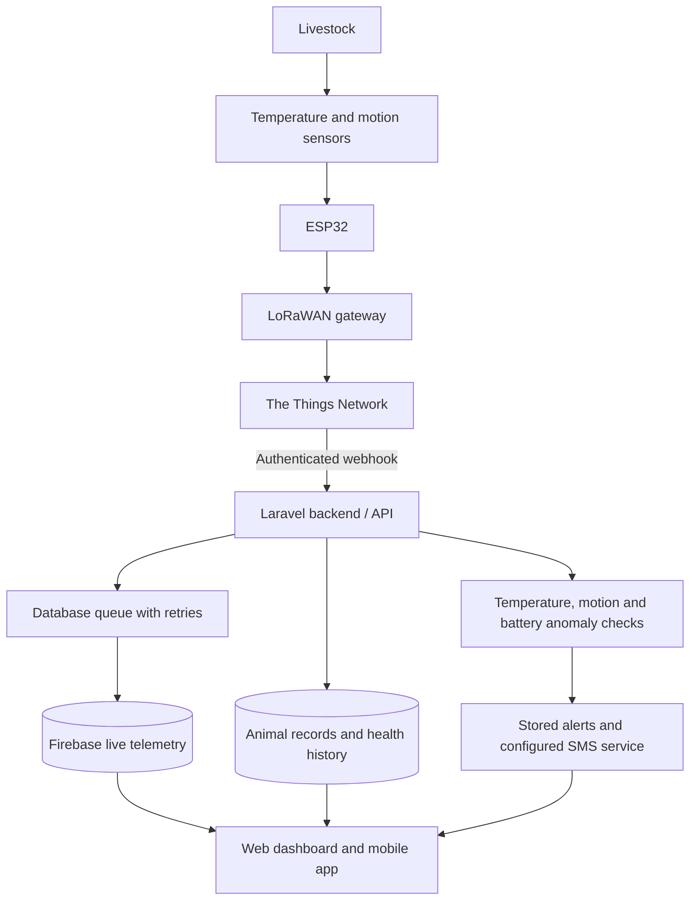

# AgriSentry

Livestock monitoring through ESP32 collars, LoRaWAN, The Things Network, Laravel, and Firebase Realtime Database.



The backend owns animal records, authentication and anomaly detection. Firebase distributes the latest collar state to signed-in clients. The app refreshes its API data when telemetry changes and retains polling as a fallback.

## Run locally

Use PHP 8.3+ with the required Composer extensions and Node.js compatible with the installed Vite release.

1. Install backend dependencies with `composer install` and frontend dependencies with `npm ci`.
2. Copy `.env.example` to `.env` only on a fresh installation, configure the database, and run `php artisan key:generate`.
3. Run `php artisan migrate`, then `npm run build`.
4. Start Laravel with `php artisan serve --host=0.0.0.0`.
5. Follow [Firebase setup](FIREBASE-SETUP.md), including the database queue worker.
6. Follow [collar setup](firmware/README.md) for the ESP32 and TTN. The mobile app is in `../agrisentry-mobile`.

## Uplink contract

Configure TTN to POST uplink messages to `https://YOUR_HOST/api/lorawan/uplink` with `X-LoRaWAN-Secret` matching `LORAWAN_SHARED_SECRET`. Register and assign the collar first. An unset server secret disables ingestion.

The endpoint accepts TTN decoded payloads, the firmware's six-byte base64 payload, or flat JSON:

```json
{
  "device_id": "your-registered-collar-code",
  "temperature": 35.0,
  "movement": "Normal",
  "battery_level": 82
}
```

At least one sensor value is required. Battery is 0–100, temperature must be numeric within the sensor range, and movement uses the firmware labels. These checks validate data; the existing configured anomaly thresholds decide when alerts are raised. Movement-only and battery-only readings are supported.

## Checks

- Backend: `php artisan test`
- Web bundle: `npm run build`
- Mobile: `npx tsc --noEmit` from `../agrisentry-mobile`

Hardware transmission and Firebase cloud access require a live test with your gateway and project credentials.
